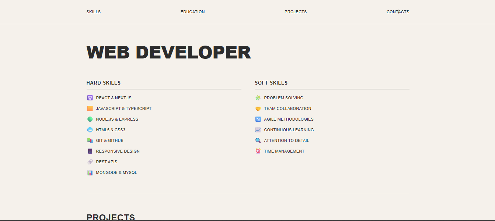
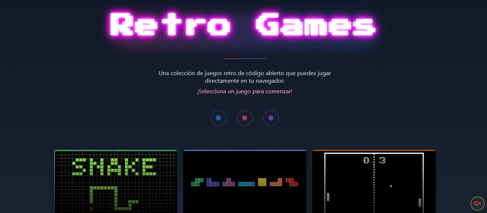

# 🌐 Portfolio Web Developer - Lio Silman

Un portfolio moderno y responsive desarrollado con React y Vite, diseñado para mostrar proyectos y habilidades de desarrollo web de manera profesional e interactiva.

## 🚀 Demo en Vivo

[Ver Portfolio](https://tu-portfolio-url.vercel.app) <!-- Actualiza con tu URL cuando lo despliegues -->

## ✨ Características

- **🎨 Diseño Moderno**: Interfaz limpia y minimalista inspirada en portfolios profesionales
- **📱 Totalmente Responsive**: Optimizado para desktop, tablet y móviles
- **⚡ Navegación Modal**: Secciones interactivas con modales para mejor UX
- **🖼️ Proyectos con Imágenes**: Showcase visual de proyectos reales
- **📞 Integración WhatsApp**: Contacto directo con un click
- **🔗 Redes Sociales**: Enlaces a LinkedIn y GitHub con iconos SVG
- **🎯 Fácil Personalización**: Configuración centralizada en un solo archivo

## 🛠️ Tecnologías Utilizadas

### Frontend
- **React 18** - Biblioteca de JavaScript para interfaces de usuario
- **Vite** - Build tool rápido y moderno
- **CSS3** - Estilos puros con variables CSS y Flexbox/Grid
- **JavaScript ES6+** - Sintaxis moderna de JavaScript

### Herramientas de Desarrollo
- **ESLint** - Linter para mantener código limpio
- **Git** - Control de versiones
- **VS Code** - Editor de código

### Características Técnicas
- **Componentes Modulares** - Arquitectura basada en componentes reutilizables
- **Responsive Design** - Mobile-first approach
- **Optimización de Imágenes** - Carga eficiente de assets
- **Accesibilidad** - Navegación por teclado y screen readers
- **SEO Friendly** - Estructura semántica HTML5

## 📦 Instalación

### Prerrequisitos
- Node.js (versión 16 o superior)
- npm o yarn

### Pasos de Instalación

1. **Clona el repositorio**
\`\`\`bash
git clone https://github.com/liosilman/portfolio-web-developer.git
cd portfolio-web-developer
\`\`\`

2. **Instala las dependencias**
\`\`\`bash
npm install
# o
yarn install
\`\`\`

3. **Inicia el servidor de desarrollo**
\`\`\`bash
npm run dev
# o
yarn dev
\`\`\`

4. **Abre tu navegador**
\`\`\`
http://localhost:5173
\`\`\`

## 🎯 Uso y Personalización

### Configuración Personal
Toda la información personal se encuentra en un solo archivo para fácil edición:

\`\`\`javascript
// src/data/portfolioData.js
export const portfolioData = {
  personal: {
    title: "WEB DEVELOPER",
    name: "Tu Nombre",
    phone: "+54 1157685990",
    email: "tu.email@gmail.com",
    whatsapp: "+54 1157685990",
  },
  // ... más configuraciones
}
\`\`\`

### Añadir Proyectos
\`\`\`javascript
projects: [
  {
    id: 1,
    title: "Nombre del Proyecto",
    description: "Descripción del proyecto",
    link: "https://tu-proyecto.com",
    image: "/images/proyecto.png",
    technologies: ["React", "Node.js", "MongoDB"],
  },
]
\`\`\`

### Personalizar Colores
\`\`\`css
/* src/index.css */
:root {
  --bg-primary: #f5f1eb;
  --text-primary: #2c2c2c;
  --accent-color: #333;
  /* Modifica estos valores */
}
\`\`\`

## 📁 Estructura del Proyecto

\`\`\`
portfolio-web-developer/
├── public/
│   ├── images/           # Imágenes de proyectos
│   └── vite.svg
├── src/
│   ├── components/       # Componentes React
│   │   ├── ModalContent/ # Contenido de modales
│   │   ├── Contact.jsx
│   │   ├── Hero.jsx
│   │   ├── Modal.jsx
│   │   ├── Navigation.jsx
│   │   ├── Projects.jsx
│   │   └── Skills.jsx
│   ├── data/
│   │   └── portfolioData.js  # Configuración principal
│   ├── App.jsx           # Componente principal
│   ├── index.css         # Estilos globales
│   └── main.jsx          # Punto de entrada
├── index.html
├── package.json
├── vite.config.js
└── README.md
\`\`\`

## 🎨 Capturas de Pantalla

### Página Principal

### Proyectos Destacados
| Retro Games | Slack Clone |
|-------------|-------------|
|  |  |

## 📋 Principios de Desarrollo

Este proyecto sigue los principios:
- **DRY** (Don't Repeat Yourself) - Componentes reutilizables
- **KISS** (Keep It Simple, Stupid) - Código simple y mantenible
- **YAGNI** (You Aren't Gonna Need It) - Solo funcionalidades necesarias

## 📄 Licencia

Este proyecto está bajo la Licencia MIT. Ver `LICENSE` para más detalles.

## 📞 Contacto

**Lio Silman** - Desarrollador Web Full Stack

- 💼 [LinkedIn](https://www.linkedin.com/in/lionel-silman/)
- 💻 [GitHub](https://github.com/liosilman)
- 📧 Email: liosilman02@gmail.com
- 📱 WhatsApp: +54 1157685990

---

⭐ Si te gusta este proyecto, ¡dale una estrella en GitHub!

## 🔄 Actualizaciones Futuras

- [ ] Modo oscuro/claro
- [ ] Animaciones avanzadas
- [ ] Blog integrado
- [ ] Formulario de contacto funcional
- [ ] Múltiples idiomas
- [ ] PWA (Progressive Web App)

---

**Desarrollado con ❤️ por Lio Silman**
